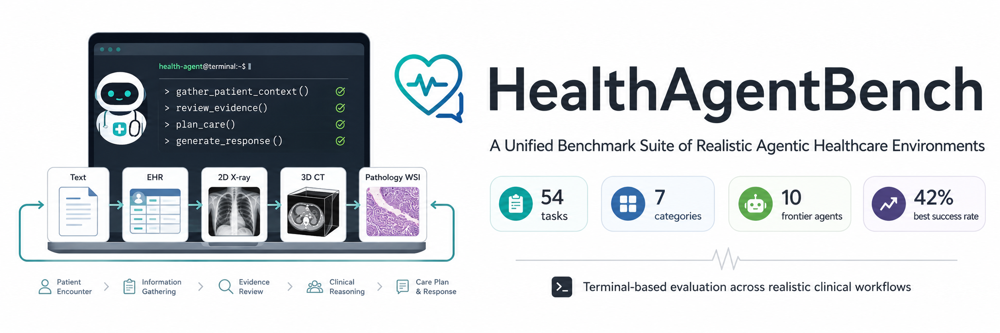

  

  <a href="https://microsoft.github.io/HealthAgentBench/">Website</a> -
  <a href="https://arxiv.org/abs/2606.31179">Paper</a> -
  <a href="https://github.com/microsoft/HealthAgentBench">Benchmark</a> -
  <a href="https://github.com/microsoft/HealthAgentBench/blob/main/README.md">Doc</a>

  
  
  
   

## 📢 Updates

* 2026-07-01: We released our [paper](https://arxiv.org/abs/2606.31179) and [website](https://microsoft.github.io/HealthAgentBench/). The benchmark will be released soon.
